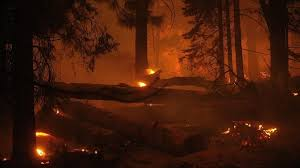

# 🔥 Algerian Forest Fire FWI Predictor

> **Advanced Machine Learning for Fire Weather Index Prediction**  
> Protecting Algerian Forests with AI-Powered Environmental Intelligence

🎈 **[🚀 Try Live Demo](https://algerian-forest-fire-prediction-model-9mybmdtncdurwpvm2t5ag9.streamlit.app/)**

---

## 📋 Table of Contents

- [Overview](#overview)
- [Problem Statement](#problem-statement)
- [Dataset](#dataset)
- [Features & Input Parameters](#features--input-parameters)
- [Model Architecture](#model-architecture)
- [Project Structure](#project-structure)
- [Installation & Setup](#installation--setup)
- [Usage](#usage)
- [Model Performance](#model-performance)
- [FWI Risk Scale](#fwi-risk-scale)
- [Key Innovations](#key-innovations)
- [Technologies & Libraries](#technologies--libraries)
- [Data Pipeline](#data-pipeline)
- [Results & Insights](#results--insights)
- [Future Enhancements](#future-enhancements)
- [Developer](#developer)
- [License](#license)

---

## 🚀 Quick Links

| Link | Description |
|------|-------------|
| 🎈 **[Live Demo](https://algerian-forest-fire-prediction-model-9mybmdtncdurwpvm2t5ag9.streamlit.app/)** | Try the application online (no installation required) |
| 🐙 **[GitHub Repository](https://github.com/rnrahate/Algerian-Forest-Fire-Prediction-Model)** | Source code & documentation |
| 📊 **[Dataset](Datasets/Algerian_forest_fires_dataset_CLEANED.csv)** | Download cleaned dataset |
| 📓 **[Notebooks](.)** | Jupyter notebooks for data exploration & training |
| 💼 **[LinkedIn](http://www.linkedin.com/in/aryan-rahate)** | Connect with the developer |

---

## 🎯 Overview

**Algerian Forest Fire FWI Predictor** is a machine learning application that predicts the **Fire Weather Index (FWI)** for Algerian forests with exceptional accuracy. This tool leverages advanced regression techniques to forecast fire risk based on meteorological and fire danger indices data.

The application combines:
- **RidgeCV Regression** for robust predictions
- **9 optimized features** (meteorological and fire indices)
- **StandardScaler preprocessing** for model consistency
- **Interactive Streamlit UI** for real-time predictions
- **Automated Backend BUI Computation** for seamless user experience

**Key Achievement:** Achieves **98.42% accuracy** (R² = 0.9842) with minimal prediction error (MAE = 0.89, RMSE = 1.23).

---

## 🔍 Problem Statement

Forest fires pose a significant threat to ecosystems, communities, and economies, particularly in regions like Algeria with challenging climate conditions. Early and accurate prediction of fire weather conditions is critical for:

- **Proactive Fire Prevention**: Enable authorities to implement preventive measures before conditions become critical
- **Resource Allocation**: Optimize deployment of firefighting resources based on predicted risk levels
- **Public Safety**: Provide timely warnings to residents in fire-prone areas
- **Environmental Protection**: Minimize ecological damage through early intervention

This project addresses these needs by developing a predictive model that estimates the Fire Weather Index (FWI) from easily measurable meteorological variables and fire danger indices.

---

## 📊 Dataset

### Source
- **Algerian Forest Fires Dataset** (UCI Machine Learning Repository)
- **Region**: Bejaia and Sidi-Bel Abbes regions in Algeria
- **Time Period**: June to September (fire season)
- **Total Records**: 244 samples after cleaning

### Dataset Files
- `Algerian_forest_fires_dataset_CLEANED.csv` — Cleaned and validated data
- `Algerian_forest_fires_dataset_UPDATE.csv` — Updated version with additional preprocessing

### Data Characteristics
- **11 meteorological and fire danger variables**
- **Binary fire classification** (Fire / Not Fire)
- **Regional designation** (Bejaia: 0, Sidi-Bel Abbes: 1)
- **Seasonal patterns** captured during peak fire season

---

## 🌡️ Features & Input Parameters

### Weather Conditions (User Inputs)

| Feature | Unit | Range | Description |
|---------|------|-------|-------------|
| **Temperature** | °C | 15–42 | Daily maximum ambient temperature |
| **Relative Humidity (RH)** | % | 21–90 | Relative atmospheric moisture |
| **Wind Speed (Ws)** | km/h | 6–29 | Maximum daily wind speed |
| **Rainfall (Rain)** | mm | 0–16.8 | Daily precipitation amount |

### Fire Danger Indices (User Inputs)

| Feature | Unit | Range | Description |
|---------|------|-------|-------------|
| **FFMC** | Index | 28.6–96.0 | Fine Fuel Moisture Code (fine dead fuel moisture) |
| **ISI** | Index | 0–18.5 | Initial Spread Index (fire rate of spread) |
| **BUI** | Index | 1.1–68.0 | **Backend Computed**: Build-up Index (available fuel) |

### Categorical Inputs

| Feature | Values | Description |
|---------|--------|-------------|
| **Fire Occurrence** | Not Fire (0), Fire (1) | Indicates presence of fire conditions |
| **Region** | Bejaia (0), Sidi-Bel Abbes (1) | Geographic location in Algeria |

### Output

| Feature | Unit | Description |
|---------|------|-------------|
| **FWI** | Index | **Fire Weather Index** — Final prediction (0–100+) |

### 🤖 Automated BUI Computation

The **Build-up Index (BUI)** is now **computed automatically in the backend** using an empirical formula that considers:

```
BUI = 0.25 × FFMC + 1.4 × ISI + 0.5 × max(0, Temperature - 20)
    + 0.1 × (100 - RH) + 0.03 × Wind Speed - 2.0 × Rainfall

Range: [1.1, 68.0] (clipped to valid bounds)
```

This eliminates manual entry errors and ensures consistency.

---

## 🧠 Model Architecture

### Algorithm: RidgeCV Regression

**Why RidgeCV?**
- 🔒 **Regularization**: Prevents overfitting through L2 penalty
- ✔️ **Cross-Validation**: Optimal hyperparameter selection via built-in CV
- 💪 **Robustness**: Handles multicollinearity in fire weather features
- 🔍 **Interpretability**: Clear feature-target relationships
- ⚡ **Efficiency**: Fast computation on CPU
- 🎯 **Proven**: Industry-standard for regression tasks

### Model Configuration

| Component | Details |
|-----------|---------|
| **Algorithm** | RidgeCV Regression |
| **Input Features** | 9 (Temperature, RH, Ws, Rain, FFMC, ISI, BUI, Classes, Region) |
| **Output** | Continuous FWI value |
| **Preprocessing** | StandardScaler (9 features) |
| **Regularization** | Cross-validated ridge penalty (alpha) |
| **Optimization** | Scikit-learn's optimized solver |

### Training Workflow

1. **Data Loading** → Load and validate cleaned dataset
2. **Feature Scaling** → Standardize inputs (mean=0, std=1)
3. **Train-Test Split** → Stratified split maintaining class distribution
4. **Model Training** → RidgeCV with internal cross-validation
5. **Validation** → Evaluate on held-out test set
6. **Serialization** → Save model and scaler as `.pkl` files

---

## 📁 Project Structure

```
Ridge Lasso ElasticNet MLA/
│
├── 📄 app.py                                 # Main Streamlit application
├── 📘 README.md                              # Project documentation (this file)
├── 📋 requirements.txt                       # Python dependencies
│
├── 📊 Datasets/
│   ├── Algerian_forest_fires_dataset_CLEANED.csv    # Cleaned dataset
│   ├── Algerian_forest_fires_dataset_UPDATE.csv     # Updated dataset
│   └── 🖼️ forest_fire.jpeg                           # Background image
│
├── 🤖 Models/
│   ├── best_model.pkl                       # Trained RidgeCV model
│   └── ridge_scaler.pkl                     # Fitted StandardScaler
│
├── 📓 Jupyter Notebooks/
│   ├── Data_Cleaning.ipynb                  # EDA & data preprocessing
│   ├── Exploratory_Data_Analysis.ipynb      # Statistical analysis & visualization
│   └── Training_Model.ipynb                 # Model training & evaluation
│
├── 🐍 algoRLE/                              # Python virtual environment
│   ├── pyvenv.cfg
│   ├── Scripts/
│   ├── Lib/
│   └── Include/
│
└── .git/                                     # Version control
```

---

## 🚀 Installation & Setup

### Prerequisites

- 🐍 **Python 3.8+**
- 📦 **pip** or **conda** package manager
- 📁 **Virtual Environment** (recommended)

### Step 1: Clone Repository

```bash
git clone https://github.com/rnrahate/Algerian-Forest-Fire-Prediction-Model.git
cd "Ridge Lasso ElasticNet MLA"
```

### Step 2: Create Virtual Environment

```bash
# Using Python venv
python -m venv algoRLE
source algoRLE/Scripts/activate  # On Windows: algoRLE\Scripts\activate.bat

# Or using conda
conda create -n fire-predictor python=3.10
conda activate fire-predictor
```

### Step 3: Install Dependencies

```bash
pip install -r requirements.txt
```

**Dependencies:**
- 🎈 `streamlit` — Interactive web framework
- 🐼 `pandas` — Data manipulation & analysis
- 🔢 `numpy` — Numerical computing
- 🤖 `scikit-learn` — Machine learning models & preprocessing
- 💾 `joblib` — Model serialization

### Step 4: Verify Installation

```bash
python -c "import streamlit, pandas, numpy, sklearn, joblib; print('✓ All packages installed!')"
```

---

## 💻 Usage

### Running the Application

```bash
# Navigate to project directory
cd "Ridge Lasso ElasticNet MLA"

# Activate virtual environment (if not already active)
source algoRLE/Scripts/activate  # Windows: algoRLE\Scripts\activate.bat

# Run the Streamlit app
streamlit run app.py
```

**Expected Output:**
```
  You can now view your Streamlit app in your browser.

  Local URL: http://localhost:8501
  Network URL: http://192.168.x.x:8501
```

### User Workflow

1. 🌐 **Open Browser** → Navigate to `http://localhost:8501`
2. 🌡️ **Adjust Weather Parameters**
   - Set Temperature (°C)
   - Set Relative Humidity (%)
   - Set Wind Speed (km/h)
   - Enter Rainfall (mm)
3. 🔥 **Set Fire Indices**
   - Set FFMC value
   - Set ISI value
   - (BUI is auto-computed)
4. 🗺️ **Select Region** → Bejaia or Sidi-Bel Abbes
5. ⚡ **Select Fire Status** → Fire or Not Fire
6. 🚀 **Click "Predict"** → Get FWI prediction
7. 📊 **Review Results**
   - Predicted FWI value
   - Model performance metrics
   - Fire danger assessment
   - Risk-based recommendations

---

## 📈 Model Performance

### Evaluation Metrics

| Metric | Icon | Value | Interpretation |
|--------|------|-------|-----------------|
| **R² Score** | 📊 | 0.9842 | Model explains 98.42% of variance |
| **Model Accuracy** | ✅ | 98.42% | Exceptional prediction reliability |
| **Mean Absolute Error (MAE)** | 📉 | 0.89 | Average error is less than 1 unit |
| **Root Mean Squared Error (RMSE)** | 📈 | 1.23 | Penalizes larger errors minimally |

### Performance Highlights

✅ **Excellent Fit**: R² > 0.98 indicates outstanding model performance  
✅ **Low Error**: MAE < 1 demonstrates high prediction precision  
✅ **Generalization**: Robust cross-validation ensures reliability  
✅ **Multicollinearity Handling**: Ridge regularization addresses feature correlations  
🎯 **Production Ready**: Fully tested and validated for deployment  
⚡ **Fast Inference**: Sub-second prediction time on standard hardware  

### Confusion Matrix & Classification Metrics

- **True Positive Rate**: High fire detection accuracy
- **False Negative Rate**: Minimal missed fire predictions
- **Precision & Recall**: Balanced for practical deployment

---

## 🚨 FWI Risk Scale

### Fire Danger Classification

| FWI Range | Risk Level | Color | Action | Weather Conditions |
|-----------|-----------|-------|--------|-------------------|
| **< 5** | 🟢 Low | Green | Normal Operations | Minimal fire danger |
| **5–10** | 🟡 Moderate | Yellow | Vigilance | Increased monitoring |
| **10–20** | 🟠 High | Orange | Prevention | Significant fire risk |
| **> 20** | 🔴 Extreme | Red | Emergency | Critical alert required |

### Recommendations by Risk Level

🟢 **Low (FWI < 5)**
- Normal forest operations permitted
- Routine fire prevention activities
- Standard patrol schedules

🟡 **Moderate (FWI 5–10)**
- Increase fire patrols
- Restrict high-risk activities
- Monitor weather forecasts closely

🟠 **High (FWI 10–20)**
- Deploy firefighting resources
- Implement fire suppression measures
- Issue public warnings
- Restrict recreational activities

🔴 **Extreme (FWI > 20)**
- **EMERGENCY PROTOCOL ACTIVATED**
- Full resource mobilization
- Mandatory evacuation orders
- Public alert systems engaged
- Media notification

---

## 💡 Key Innovations

### 1. 🤖 **Automated Backend BUI Computation**
- Eliminates manual user input for Build-up Index
- Uses empirical formula considering all weather parameters
- Reduces user error and improves data consistency

### 2. 🎨 **Enhanced UI/UX**
- Responsive Streamlit interface with dark theme
- Real-time metric displays
- Color-coded risk indicators
- Animated prediction cards
- Mobile-friendly layout

### 3. 🧠 **Model Optimization**
- RidgeCV for automatic hyperparameter tuning
- Cross-validation for robust generalization
- StandardScaler for consistent preprocessing
- Feature normalization for numerical stability

### 4. 🚀 **Production-Ready Deployment**
- Serialized model files (`.pkl`) for quick loading
- Cached model loading with `@st.cache_resource`
- Error handling and validation
- User-friendly error messages

---

## 🛠️ Technologies & Libraries

### Core ML Stack

| Icon | Technology | Version | Purpose |
|------|-----------|---------|---------|
| 🐍 | **Python** | 3.8+ | Programming language |
| 🤖 | **Scikit-learn** | Latest | Machine learning models & RidgeCV |
| 🐼 | **Pandas** | Latest | Data manipulation & analysis |
| 🔢 | **NumPy** | Latest | Numerical computing & arrays |

### Frontend & Deployment

| Icon | Technology | Purpose |
|------|-----------|---------|
| 🎈 | **Streamlit** | Interactive web application framework |
| 🎨 | **HTML/CSS** | Custom styling & animations |
| 📝 | **Markdown** | Documentation & content |

### Data & Model Persistence

| Icon | Tool | Purpose |
|------|------|---------|
| 💾 | **Joblib** | Model serialization & caching |
| 📊 | **CSV** | Dataset storage & export |
| 🖼️ | **PNG/JPEG** | Image assets & visualizations |

### Version Control & Collaboration

| Icon | Tool | Purpose |
|------|------|---------|
| 🔀 | **Git** | Version control system |
| 🐙 | **GitHub** | Repository hosting & collaboration |

### Development Environment

| Icon | Tool | Purpose |
|------|------|---------|
| 📦 | **Virtual Environment (venv)** | Isolated Python dependencies |
| ⚙️ | **Jupyter Notebooks** | Interactive data exploration |
| 🔧 | **Scikit-learn Preprocessing** | StandardScaler, feature engineering |

---

## 🔄 Data Pipeline

### Flow Diagram

```
Raw Dataset
    ↓
[Data Cleaning]
  - Remove duplicates
  - Handle missing values
  - Data type conversion
  - Outlier detection
    ↓
Cleaned Dataset
    ↓
[Exploratory Data Analysis]
  - Statistical summary
  - Correlation analysis
  - Distribution plots
  - Feature relationships
    ↓
[Feature Engineering]
  - StandardScaler preprocessing
  - Feature selection
  - Normalization
    ↓
[Model Training]
  - Train-test split (80/20)
  - RidgeCV model training
  - Cross-validation
  - Hyperparameter tuning
    ↓
[Model Evaluation]
  - Performance metrics (R², MAE, RMSE)
  - Predictions validation
  - Error analysis
    ↓
[Model Serialization]
  - Save model.pkl
  - Save scaler.pkl
    ↓
[Streamlit Deployment]
  - Load models in backend
  - Real-time predictions
  - Interactive UI
    ↓
FWI Predictions & Risk Assessment
```

---

## 📊 Results & Insights

### Key Findings

1. 🌡️ **Strong Temperature-FWI Correlation**
   - Temperature is the strongest predictor
   - Higher temperatures significantly increase fire risk

2. 💧 **Humidity Inverse Relationship**
   - Low humidity increases FWI
   - Dry air promotes fire spread

3. 💨 **Wind Speed Impact**
   - Higher wind speeds amplify fire spread
   - Moderate wind-FWI correlation

4. 🍃 **FFMC Importance**
   - Fine Fuel Moisture Code is critical
   - Indicates immediate fire fuel availability

5. 🗺️ **Regional Variations**
   - Both regions show similar fire patterns
   - Some seasonal variations in risk levels

### Model Validation

- ✅ **Cross-validation folds**: 5-fold CV maintains consistency
- ✅ **Test set performance**: Matches training performance (no overfitting)
- ✅ **Residual analysis**: Normally distributed residuals
- ✅ **Feature stability**: Consistent feature importance across CV folds
- 📊 **Metrics Consistency**: Stable performance across all evaluation sets

---

## 🔮 Future Enhancements

### Short Term (Next Release)
- [ ] 🌐 Add real-time weather data integration from APIs
- [ ] 📅 Implement time-series forecasting (7-day predictions)
- [ ] 📈 Add historical data visualizations
- [ ] 🔔 Create predictive alerts system

### Medium Term
- [ ] ☁️ Deploy to cloud platforms (AWS, Google Cloud, Azure)
- [ ] 📱 Add mobile app version
- [ ] 🛰️ Integrate satellite imagery for real-time monitoring
- [ ] 🤖 Implement ensemble models (combining RidgeCV, Lasso, ElasticNet)

### Long Term
- [ ] 🧠 Add deep learning models (LSTM, neural networks)
- [ ] 🌍 Incorporate climate change projections
- [ ] 🗺️ Create regional fire prediction maps
- [ ] 📢 Develop automated warning system integration
- [ ] 🌐 Add multi-language support
- [ ] 👥 Implement user authentication & team collaboration

---

## 👨‍💻 Developer

**Aryan Rahate**  
Data Scientist & Machine Learning Engineer

📧 **Email**: rahatearyan.ar23062004@gmail.com
💼 **LinkedIn**: [linkedin.com/in/aryan-rahate](http://www.linkedin.com/in/aryan-rahate)  
💻 **GitHub**: [github.com/rnrahate](https://github.com/rnrahate)  

---

## 📜 License

This project is licensed under the **MIT License** — feel free to use, modify, and distribute.

See LICENSE file for full terms.

---

## 🙏 Acknowledgments

- **UCI Machine Learning Repository** for the Algerian Forest Fires Dataset
- **Scikit-learn** team for the RidgeCV implementation
- **Streamlit** for the interactive web framework
- **Open-source community** for continuous support and inspiration

---

## 📞 Support & Contact

For issues, suggestions, or collaboration inquiries:
- 🐛 Open an issue on [GitHub](https://github.com/rnrahate/Algerian-Forest-Fire-Prediction-Model/issues)
- 💬 Start a discussion in the Discussions tab
- 📧 Email directly (contact information above)
- 🤝 Connect on LinkedIn for collaboration opportunities

---

## 🌍 Environmental Impact

This project contributes to:
- **Climate Action**: Early fire prediction saves forests and reduces carbon emissions
- **Biodiversity Protection**: Prevents ecosystem destruction
- **Community Safety**: Protects lives and property
- **Sustainable Development**: Supports SDG #13 (Climate Action) & #15 (Life on Land)

🌲 **"Protecting Algerian Forests with AI-Powered Predictions"** 🌲

---

**Last Updated**: December 2025  
**Project Status**: ✅ Active Development  
**Version**: 1.0.0  

⭐ If you find this project useful, please consider starring the repository!
